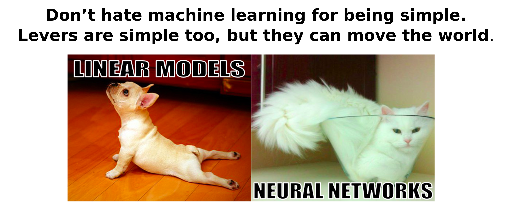

 I am a data scientist with +8 years of work experience in Machine Learning, Statistics, and Data Analysis. I have a critical thinking, and I am always compromised to bring fast, smart and innovative solutions to complex problems. I have a Ph.D. Degree in Computer Science and Mathematics, with an advanced formation in statistics learning and programming. Linguistic knowledge to write and speak fluent English and Spanish. Good Team Member/Leader. 

<h2>Main Skills</h2>

* Mathematics     
	10+ years of experience
	
* Probabilities and Statistics      
	10+ years of experience
		
* Machine Learning     
	8+ years of experience     
	Classification, Regression, Linear Models, Ensemble Models (Bagging and Boosting), NN, Sklearn, Caret, ..
	
* Deep Learning     
	2+ years of experience     
	NN, Convolutional NN, Recurrent NN, Generative Adversarial NN, Pytorch, Keras,...

* Programming      
	8+ years of experience     
	Python, R, Matlab     

* SQL     
	4+ years of experience     
	MySQL, BigQuery, PostgreSQL     

* Data Wrangling*      
	8+ years of experience     
	Structuring, Cleaning (Missing Data, Outliers), Enriching, Validation and Publishing, Numpy, Pandas, ...     

* Data Visualization (8+ years, Seaborn, MatPlotLib, ggplot)      
	8+ years of experience     
	Seaborn, MatPlotLib, ggplot     

